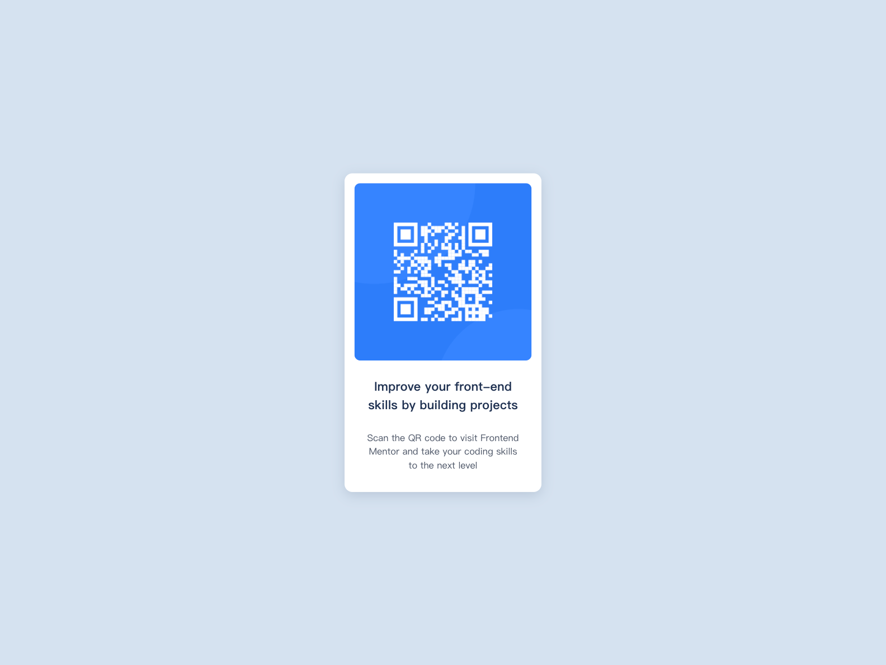

<h1>Frontend Mentor - QR code component solution</h1>

  This is a solution to the
  <a href="https://www.frontendmentor.io/challenges/qr-code-component-iux_sIO_H"
    >QR code component challenge on Frontend Mentor</a
  >. Frontend Mentor challenges help you improve your coding skills by building
  realistic projects.

<h2>Table of contents</h2>

<ul>
  <li>
    <a href="#overview">Overview</a>
    <ul>
      <li><a href="#screenshot">Screenshot</a></li>
      <li><a href="#links">Links</a></li>
    </ul>
  </li>
  <li>
    <a href="#my-process">My process</a>
    <ul>
      <li><a href="#built-with">Built with</a></li>
      <li><a href="#what-i-learned">What I learned</a></li>
      <li><a href="#userful-recourses">Useful Resources</a></li>
    </ul>
  </li>
  <li><a href="#author">Author</a></li>
  <li><a href="#acknowledgments">Acknowledgments</a></li>
</ul>

<h2 id="overview">Overview</h2>

<h3 id="screenshot">Screenshot</h3>

<h3 id="links">Links</h3>

<h4><a href="">Solution URL</a></h4>
<h4><a href="">Live Site URL</a></h4>

<h2 id="my-process">My process</h2>

<h3 id="built-with">Built with</h3>

<ul>
  <li>Semantic HTML5 markup</li>
  <li>Flex-box</li>
  <li>CSS compare function</li>
  <li>Mobile-first</li>
</ul>

<h3 id="what-i-learned">What I learned</h3>

<h4>I have learned</h4>
<ol>
  <li>
    CSS comparison function
    

      I hoped that this card could shrink down in a proper way, so I used clamp,
      max, min on my padding, font-size.
    

  </li>
  <li>
    Cursor url
    

      At the beginning, I wanted to use Javascript to help me trace my cursor
      and replace it to the frontend-mentor icon.
    

    

      But when I thought how it would cause the performance, I start to think
      any other way to reach the same purpose.
    

    

      And I found
      <a href="https://developer.mozilla.org/en-US/docs/Web/CSS/cursor"
        >the document of 'cursor'</a
      >
      on the MDN, it had url usage in CSS.
    

    

      It said that you could import your file images by url(), and we could use
      a space to separate (x, y) to determine the cursor hot-spot, and at last,
      we need to set the keyword value of cursor, whatever it's 'pointer' or
      'auto' etc.
    

    <code> .card__qr-code { cursor: url(...) x y, auto; } </code>
  </li>
</ol>

<h3 id="useful-resources">Useful Resources</h3>

<a href="https://developer.mozilla.org/en-US/docs/Web/CSS/cursor">MDN - cursor</a>

<h2 id="author">Author</h2>

<ul>
  <li>
    My github - <a href="https://github.com/Beginneraboutlife116">Wei Kai</a>
  </li>
  <li>
    Frontend Mentor -
    <a href="https://www.frontendmentor.io/profile/Beginneraboutlife116"
      >@Beginneraboutlife116</a
    >
  </li>
  <li>Twitter - <a href="https://twitter.com/WeiKaiLin2">@WeiKaiLin2</a></li>
</ul>
